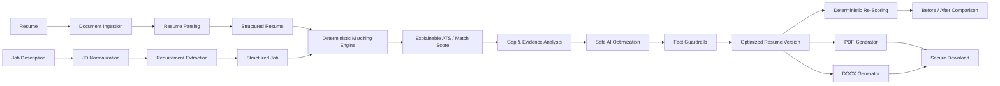
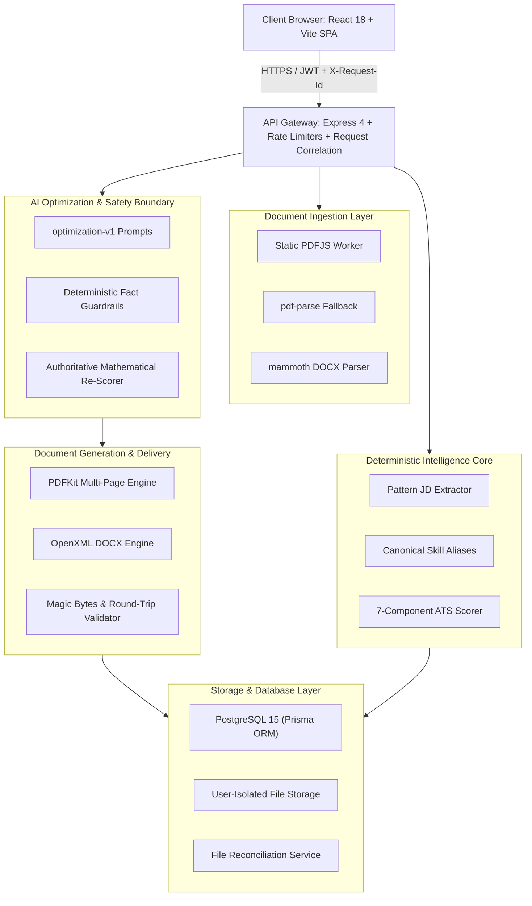

# ResumeIQ

### Evidence-Driven Resume Intelligence, Job Matching & Safe AI Optimization

ResumeIQ is a full-stack SaaS platform that analyzes resumes against target job descriptions, produces an explainable deterministic compatibility score, identifies evidence-backed gaps, and generates fact-preserving resume optimizations.

The platform is designed around a simple principle:

> **AI may improve how a candidate presents verified experience, but it must never become the source of truth for candidate qualifications or the final match score.**

ResumeIQ combines deterministic document processing, structured job/resume intelligence, explainable matching, guarded LLM optimization, versioned resume generation, and secure PDF/DOCX delivery into one end-to-end workflow.

---

## Product Overview

ResumeIQ turns a resume and target job description into an evidence-backed optimization workflow:



---

## 🚀 Key Features

- **Deterministic ATS Scoring Engine**: 100% mathematical, reproducible scoring evaluated across 7 weighted dimensions (skills, tech, keywords, experience, education, certifications, responsibilities) with exact evidence citations. AI never dictates the authoritative score.
- **Safe AI Optimization**: Phrasing enhancements powered by Google Gemini (`optimization-v1`) with untrusted data isolation (`<<<UNTRUSTED>>>`) and strict post-generation fact guardrails that automatically reject unevidenced technologies, fake certifications, or invented metrics.
- **Robust Resume Ingestion Stack**: 3-tier parsing fallback (Static PDFJS Worker → pdf-parse → pdf2json → mammoth DOCX) with timeout safeguards and user-isolated storage.
- **Enterprise Document Generation**: Generates clean, multi-page, ATS-friendly PDF and DOCX files with automated magic bytes and round-trip parser verification.
- **Resume Versioning & Diff Comparison**: Immutable original resumes with sequential version tracking, detailed side-by-side diffs, and before/after score metrics.
- **Modern Full-Stack Frontend**: Fast React 18 single-page application built with Vite, TypeScript, TailwindCSS, Zustand state management, and React Router.
- **Production Hardened**: Structured Winston logging with `X-Request-Id` correlation, dedicated authentication rate limiting, and storage orphan reconciliation.

---

## 🏗️ Architecture



---

## 🎯 Quick Start

### Prerequisites
- Node.js 20+
- PostgreSQL 15+ (or Docker & Docker Compose)
- Google Gemini API Key (optional for local mock testing; required for live AI optimization)

### 1. Clone & Configure
```bash
git clone https://github.com/Chandan735729/ResumeIQ.git
cd ResumeIQ

# Configure environment variables
cp .env.example .env
cp backend/.env.example backend/.env
```

### 2. Backend Setup
```bash
cd backend
npm ci
npx prisma generate
npx prisma migrate deploy

# Run tests
npm test -- --runInBand

# Start backend server (port 3000)
npm run dev
```

### 3. Frontend Setup
```bash
cd ../frontend
npm install

# Run type check and lint
npm run type-check
npm run lint

# Start development server (port 3001)
npm run dev
```

---

## 🧪 Testing & Verification

ResumeIQ includes a comprehensive suite of unit, integration, and security tests:

```bash
# In backend/ directory:
npm test                        # Runs all 216+ non-DB unit & integration tests
npm run type-check              # TypeScript verification (0 errors)
npm run lint                    # ESLint code quality (0 errors)
npm run build                   # Production compilation

# In frontend/ directory:
npm run type-check              # TypeScript verification (0 errors)
npm run lint                    # ESLint verification (0 errors)
npm run build                   # Production bundle build
```

---

## 📚 Documentation Index

All engineering designs, security models, phase reports, and audit logs are cataloged under the [`docs/`](./docs/) directory:

- **Architecture**:
  - [Project Context & Decisions](./docs/architecture/PROJECT_CONTEXT.md)
  - [Authentication Architecture](./docs/architecture/AUTHENTICATION_DESIGN.md)
  - [File Upload Architecture](./docs/architecture/FILE_UPLOAD_DESIGN.md)
  - [Resume Parser Design](./docs/architecture/RESUME_PARSER_DESIGN.md)
  - [Parser Implementation Plan](./docs/architecture/RESUME_PARSER_IMPLEMENTATION_PLAN.md)
- **Security & Reliability**:
  - [Security Model & Threat Mitigations](./docs/security/SECURITY_MODEL.md)
  - [Backup & Disaster Recovery Runbook](./docs/BACKUP_RECOVERY.md)
  - [Final Production Audit](./docs/FINAL_PRODUCTION_AUDIT.md)
  - [Production Readiness Audit](./docs/PRODUCTION_READINESS.md)
  - [Issue Tracker](./docs/ISSUE_TRACKER.md)
  - [Git Release Report](./docs/GIT_RELEASE_REPORT.md)
- **Testing & QA**:
  - [Authentication Test Plan](./docs/testing/AUTHENTICATION_TEST_PLAN.md)
  - [Resume Parser Test Plan](./docs/testing/RESUME_PARSER_TEST_PLAN.md)
  - [Resume Parser Dataset Plan](./docs/testing/RESUME_PARSER_DATASET_PLAN.md)
- **Deployment**:
  - [Getting Started Guide](./docs/deployment/GETTING_STARTED.md)
- **Historical Phase Reports**:
  - [Phase 0 — Repository Baseline Audit](./docs/PHASE_REPORTS/PHASE-0-REPORT.md)
  - [Phase 1 — Foundation & Security Hardening](./docs/PHASE_REPORTS/PHASE-1-REPORT.md)
  - [Phase 1C — CI & Parser Quality Gate](./docs/PHASE_REPORTS/PHASE-1C-REPORT.md)
  - [Phase 2 — Database & Authentication Correctness](./docs/PHASE_REPORTS/PHASE-2-REPORT.md)
  - [Phase 3 — Resume Ingestion Subsystem](./docs/PHASE_REPORTS/PHASE-3-REPORT.md)
  - [Phase 4 — Deterministic Matching & ATS Foundation](./docs/PHASE_REPORTS/PHASE-4-REPORT.md)
  - [Phase 5 — Safe AI Optimization Engine](./docs/PHASE_REPORTS/PHASE-5-REPORT.md)
  - [Phase 6 — Document Generation & Versioning](./docs/PHASE_REPORTS/PHASE-6-REPORT.md)
  - [Phase 7 — Production Release & Frontend](./docs/PHASE_REPORTS/PHASE-7-REPORT.md)

---

## 🔒 Security & Privacy

- **No Data Hallucination**: AI suggestions are deterministic-guarded against unevidenced facts.
- **Tenant Isolation**: Strict ownership checks prevent cross-user IDOR access.
- **PII-Safe Logging**: Winston formatter sanitizes passwords, tokens, API keys, and candidate full text.
- **Header Injection Defense**: RFC 5987 filename sanitization on download headers.
- **Dedicated Rate Limiting**: Throttles brute-force attempts on login, registration, and refresh endpoints.

---

## 📊 Release Status

- **Engineering Readiness**: `96 / 100`
- **Deployment Readiness**: `82 / 100`
- **Release Decision**: `GO (CONDITIONAL)`
- **Detailed Audits**: See [FINAL_PRODUCTION_AUDIT.md](./docs/FINAL_PRODUCTION_AUDIT.md) and [PHASE_REPORTS/](./docs/PHASE_REPORTS/).

---

## 📄 License

MIT License — see [LICENSE](./LICENSE) for details.
